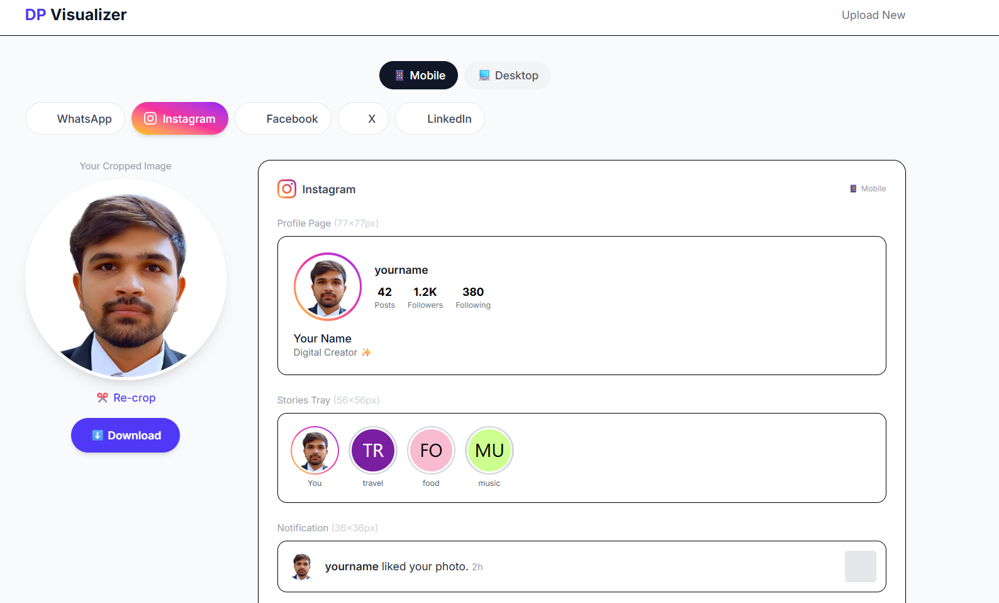
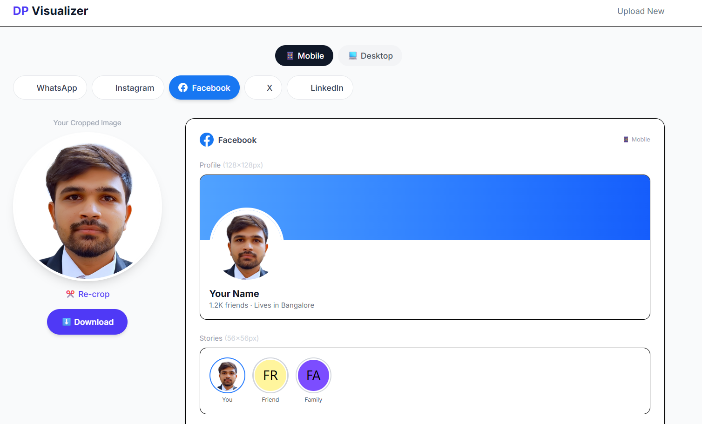
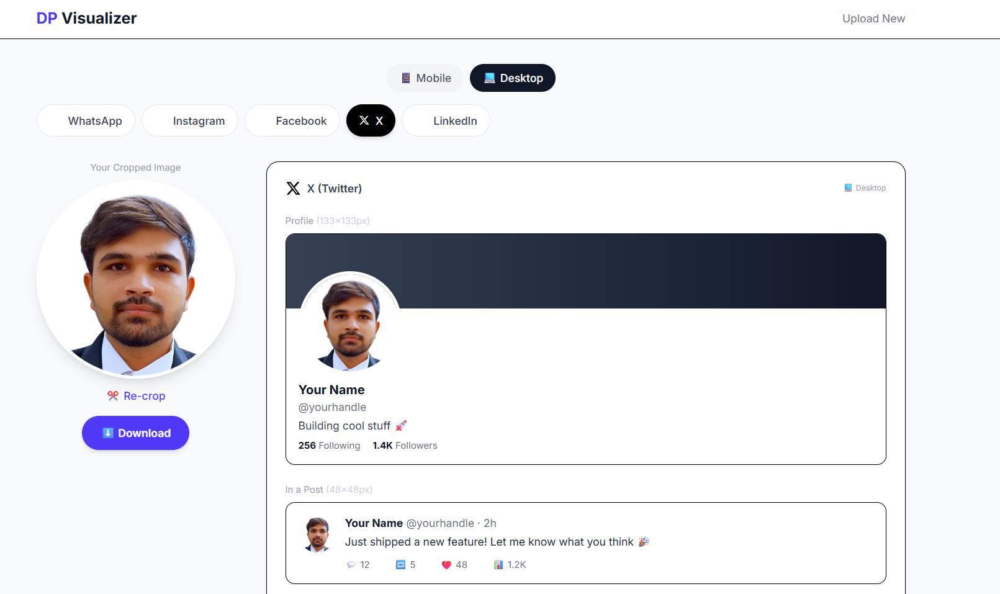
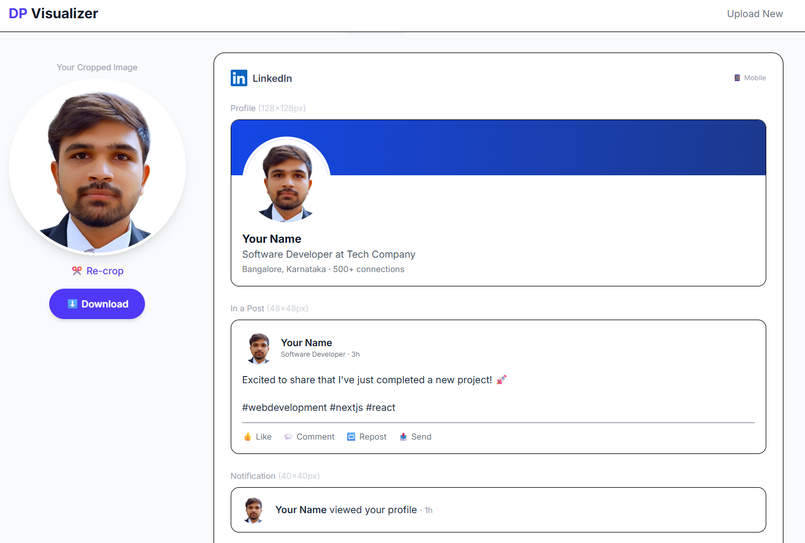

# DP Visualizer

> See how your profile picture (DP) looks across all major social media platforms — before you actually set it.

## Problem Statement

When you change your profile picture on WhatsApp, Instagram, Facebook, X, or LinkedIn, you never know how it'll actually appear to others. Each platform crops, resizes, and displays your DP differently — in chat lists, notifications, comments, stories, DMs, and profile pages. You end up uploading, checking, and re-uploading multiple times.

## Solution

**DP Visualizer** lets you upload a photo once and instantly preview how it looks across 5 platforms in all the places your DP appears:

- **WhatsApp** — Profile view, chat list, DP tap preview (square → full, just like the real app), notifications, group conversations
- **Instagram** — Profile page, stories tray, DM list, notifications, comments
- **Facebook** — Profile, stories, news feed posts, Messenger, notifications, comments
- **X (Twitter)** — Profile, tweets, replies, DM list, notifications
- **LinkedIn** — Profile, feed posts, messaging list, notifications, comments

### Key Features

- 📱💻 **Device toggle** — Switch between Mobile and Desktop to see real display sizes for each device
- ✂️ **Circular crop** — Built-in cropper with zoom so you get the perfect circle crop
- 📐 **Real pixel sizes** — Every preview uses the actual display dimensions each platform uses (e.g., WhatsApp chat list = 49px, Instagram profile = 77px mobile / 150px desktop)
- 👆 **Interactive DP tap** — WhatsApp's "tap to preview" flow (square first, then full image)
- 🔒 **100% private** — Your image never leaves your device. Everything runs client-side.
- 📱 **Mobile-first** — Designed to work great on phones (where most people actually change their DP)

## Screenshots

| Instagram | Facebook |
|-----------|----------|
|  |  |

| X (Twitter) | LinkedIn |
|-------------|----------|
|  |  |

## Tech Stack

- [Next.js 16](https://nextjs.org/) — React framework
- [React 19](https://react.dev/) — UI library
- [Tailwind CSS 4](https://tailwindcss.com/) — Styling
- [react-easy-crop](https://github.com/ValentinH/react-easy-crop) — Image cropping
- TypeScript — Type safety

## Run Locally

### Prerequisites

- [Node.js](https://nodejs.org/) (v18 or higher)
- npm (comes with Node.js)

### Steps

```bash
# 1. Clone the repo
git clone https://github.com/YOUR_USERNAME/dp-visualizer.git
cd dp-visualizer

# 2. Install dependencies
npm install

# 3. Start the dev server
npm run dev
```

Open [http://localhost:3000](http://localhost:3000) in your browser.

To view on your phone (same WiFi network), open `http://<your-laptop-ip>:3000`.

### Build for Production

```bash
npm run build
npm start
```

## How It Works

1. **Upload** — Drop or select any image
2. **Crop** — Adjust the circular crop area and zoom level
3. **Preview** — Switch between platforms and devices to see your DP everywhere
4. **Download** — Save the cropped image to use on your profiles

## License

MIT
